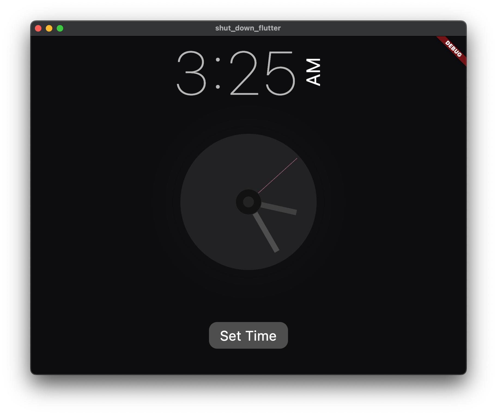

# Introduction

> "Schedule Shutdown"

With this convenient and automatic PC shutdown tool to easily schedule your computer to Shut down, and close power at any time you want.

## :bulb: Key Features (or What will you learn, if you are here to learn)

- [x] Time of day
- [x] Analog clock
- [x] Set timer

## 🚀 &nbsp;Installation

To clone and run this application, you'll need [Git](https://git-scm.com) and [Flutter](https://flutter.dev/docs/get-started/install) installed on your computer. From your command line:

```bash
# Clone this repository
$ git clone https://github.com/mostafijur566/shut_down_flutter.git

# Go into the repository
$ cd shut_down_flutter

# Install dependencies
$ flutter pub get

# Run the app
$ flutter run

# You can also run this app on Web (Not Optimized and Flutter Beta or Above Channel Required)
$ flutter run -d chrome
```

### Packages

Below are the information about packages used in this project.

| Package                                                                          |
| -------------------------------------------------------------------------------- | 
| [bitsdojo_window](https://pub.dev/packages/bitsdojo_window)                      |
| [intl](https://pub.dev/packages/intl)                                            |
| [flutter_timer_countdown](https://pub.dev/packages/flutter_timer_countdown)      |
| [slide_countdown](https://pub.dev/packages/slide_countdown)                      |
| [process_run](https://pub.dev/packages/process_run)                              |


### Directory Structure

The project directory structure is as follows:

```
├── android
├── images
├── build
├── android
├── installers
├── lib
    ├── components
        ├── clock.dart
        ├── clock_painter.dart
    ├── pages
        ├── home_page.dart
    ├── style
        ├── size_config.dart
    ├── constants.dart
    ├── main.dart
├── linux
├── macos
├── windows
├── pubspec.lock
├── pubspec.yaml

```

## :heart: Contributor

Made by [Mostafijur Rahman](https://github.com/mostafijur566)

## :camera_flash: Screenshots

   
      
   

